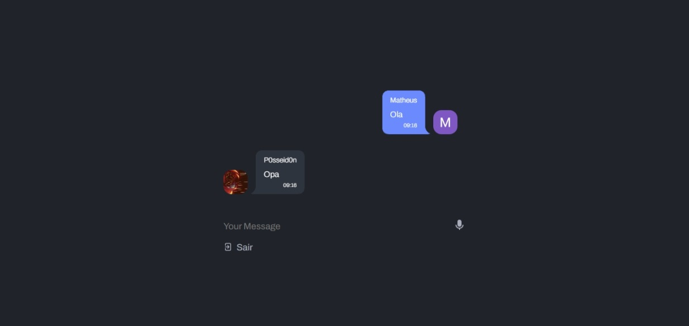

# ChatVue

Projeto de chat em tempo real utilizando Vue.js , Pinia e Firebase.

Inspiração pega do [Dribble](https://dribbble.com/shots/21097468-Web-Chat-UI)



## How to Use 🚀

```bash
# Clone o repositório
$ git clone https://github.com/P0sseid0n/ChatVue.git

# Va para o repositório
$ cd ChatVue

# Instale as dependências
$ npm install

# Rode a aplicação em modo de desenvolvimento
$ npm run dev
```

Lembre-se de criar um projeto no [Firebase](https://firebase.google.com/) e adicionar as credenciais no arquivo .env

## Features Ideas 💡

- Outros métodos de autenticação
- Salas de conversa
- Mensagens privadas
- Envio de arquivos
- Envio de emojis
- Perfil do usuário

## Contribution 🤝

Contribuições são bem-vindas! Se você tiver sugestões, correções de bugs ou melhorias para o projeto, sinta-se à vontade para abrir uma solicitação de pull.

## License 📄

Este projeto está licenciado sob a [MIT License](./LICENSE.md).
